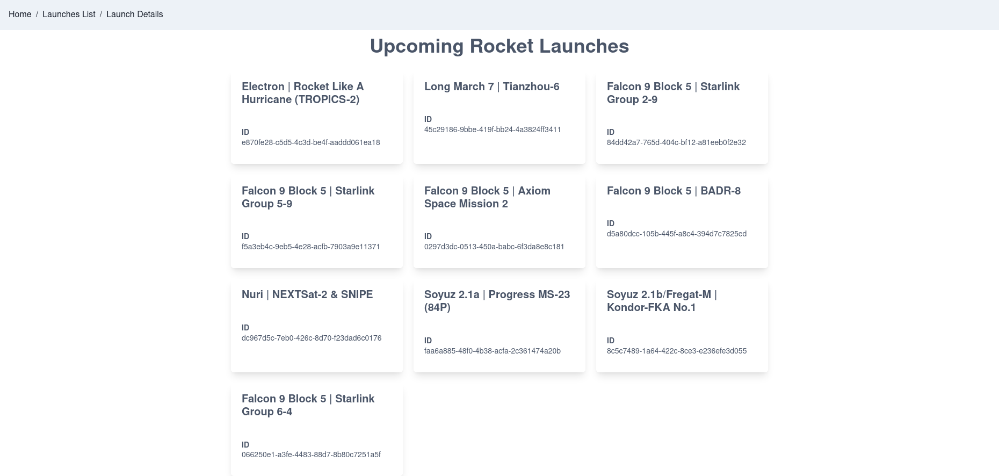

# Coding Challenge - Space Launch solution

This is a solution to the Space Launch coding challenge. 

## Table of contents

- [Overview](#overview)
  - [Instructions](#Instructions)
  - [Screenshot](#screenshot)
  - [Links](#links)
- [My process](#my-process)
  - [Built with](#built-with)
- [Author](#author)

## Overview

### Instructions

Your job is to create a basic website with two routes, one for listing upcoming rocket launches and another route to display specific data about each launch. Details on where to fetch such data is in the next section. 

Now, as part of your solution, we want you to:
Use create-react-app to bootstrap your app.
Use react-router to handle routing.
Use state management techniques such as redux/sagas to maintain the app state and send requests
Use the latest trends such as react hooks etc.
Setup a proxy using this technique

Bonus points:
We love things that are neatly presented, bonus points for styling using Chakra components.
Add any styling using just Chakra components or styled components
Space Launch Now API
Lists upcoming launches:
https://spacelaunchnow.me/api/3.3.0/launch/upcoming/

Fetch launch
https://spacelaunchnow.me/api/3.3.0/launch/7690b919-288d-43aa-8e2f-f60b882b3f5a/

Api docs:
https://spacelaunchnow.me/api/3.3.0/

### Screenshot

### Links

- Solution URL: [https://github.com/adrianburgoscolas/space-launch](https://github.com/adrianburgoscolas/space-launch)
- Live Site URL: [https://space-launch-rosy.vercel.app/](https://space-launch-rosy.vercel.app/)

## My process

### Built with

- Mobile-first workflow
- [React](https://reactjs.org/) - JS library
- [Chakra UI](https://chakra-ui.com/) - UI library
- [Redux.js](https://redux.js.org/) - A Predictable State Container for JS Apps

## Author

- Website - [Add your name here](https://www.your-site.com)
- Github - [adrianburgoscolas](https://github.com/adrianburgoscolas)
- Twitter - [@AdrianCoder](https://twitter.com/AdrianCoder)
